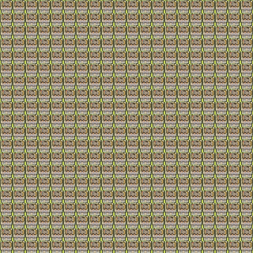

# wfc-rs

Original Algorithm: <https://github.com/mxgmn/WaveFunctionCollapse>

Explanation for tiled model: <https://robertheaton.com/2018/12/17/wavefunction-collapse-algorithm/>

Explanation for overlap model: <https://www.gridbugs.org/wave-function-collapse/>

## Renderings


```bash
cargo run --release -- ./input/flowers.png --make-gif -o 80,40 overlap -t 3,3
```


```bash
cargo run --release -- ./input/smog-city.png --make-gif -o 80,40 overlap -t 4,4
```


```bash
cargo run --release -- ./input/village.png --make-gif -o 80,40 overlap -t 3,3
```



```bash
cargo run --release -- ./input/mini-world-meadows.png --make-gif -o 20,20 tile -t 16,16
```

## Running

```bash
cargo run --release -- --help

wfc-rs 0.1.0
Brandon Stilson
Run wfc-rs

USAGE:
    wfc-rs [OPTIONS] --output-dimensions <OUTPUT_DIMENSIONS> <INPUT> <SUBCOMMAND>

ARGS:
    <INPUT>    Input location. If running in 'tiled set' mode, this is assumed to be a directory

OPTIONS:
    -h, --help
            Print help information

        --make-gif
            whether or not to make a gif (warning: very slow)

    -o, --output-dimensions <OUTPUT_DIMENSIONS>
            Output dimensions. If running in 'tiled' mode, then this is the tiles. If in
            'overlap' mode, then it is in pixels

    -V, --version
            Print version information

    -w, --with-tile-variations
            whether or not create all variations (rotations and reflections) of tiles

SUBCOMMANDS:
    help       Print this message or the help of the given subcommand(s)
    overlap
    tile
```

## TODOs

- reflections and rotations of tiles
- directional weights
- shannon entropy of cells
- 3d models

## Attribution

- [Mini World Sprites by Shade](https://merchant-shade.itch.io/16x16-mini-world-sprites)
